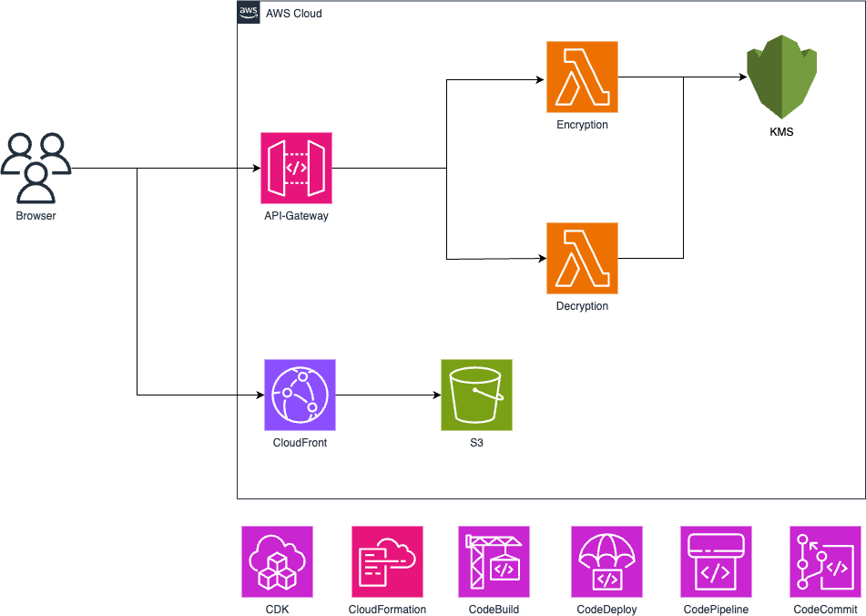
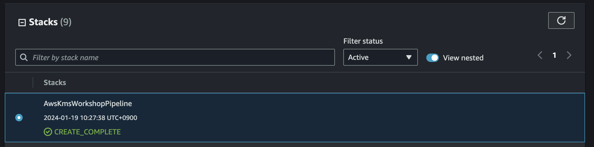
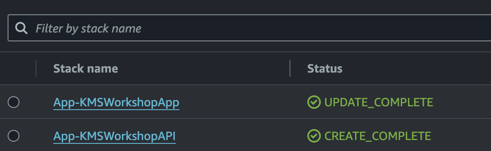
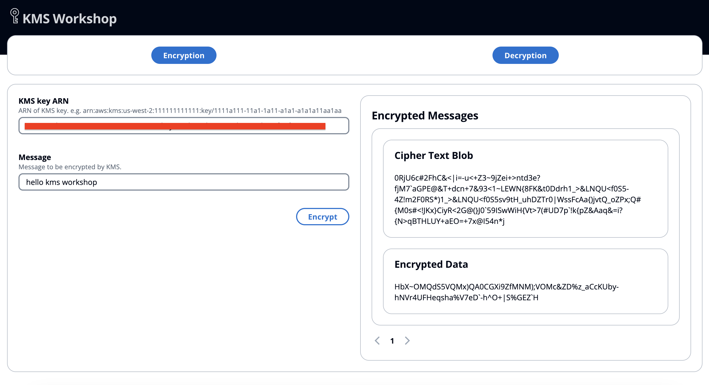

# Welcome to KMS Workshop CDK project

This is a project that uses AWS Key Management Service (KMS) to encrypt data.

The main features are:

- Generate and manage data encryption keys through KMS.
- Encrypt data to be encrypted with KMS public key to generate ciphertext. This is an envelope encryption method.
- The encrypted data is securely stored in storage.
- When reading data, decrypt with KMS private key to recover the plaintext.
- Enhance security by utilizing KMS key access control and logging capabilities.
- Reduce encryption key management overhead and provide standardized encryption.

In this way, using KMS enables safe data encryption, and reduces the complexity of key management. By utilizing the managed service provided by AWS, you can build a secure and efficient encryption system.

## Architecture



## Getting Start

#### CDK Bootstrap

Bootstrapping is the process of provisioning resources for the AWS CDK before you can deploy AWS CDK apps into an AWS environment. (An AWS environment is a combination of an AWS account and Region).

Deploying stacks with the AWS CDK requires dedicated Amazon S3 buckets and other containers to be available to AWS CloudFormation during deployment. Creating these is called bootstrapping. To bootstrap, issue:

```
cdk bootstrap
```

#### CDK Pipeline Build, Deploy

Run npm install in the project folder
This command installs the dependency packages defined in package.json.

```
npm install
```

CDK and AWS Construct libraries will be installed.
Run npm run build

```
npm run build
```

Run cdk deploy. Generates and deploys the CloudFormation template to AWS.
The AWS resources defined in the CDK app will be provisioned.

```
cdk deploy
```

You can see that the cdk pipeline has been created.



#### Setup

Copy the code of RepositoryCloneUrlHttp from the output of AwsKmsWorkshopPipeline stack. Change the URL of git remote origin to the copied repository address.

```
git remote set-url origin <copied RepositoryCloneUrlHttp>
```

push code to repository

```
git push --set-upstream origin main
```

Check that the Pipeline-AwsKmsWorkshopPipeline of the code pipeline is completed.
App-KMSWorkshopApp, App-KMSWorkshopAPI stacks in CloudFormation were created.



You can get link staticweb address in the output of KMSWorkshopApp.

#### How to use

Click encryption button, enter the value of kmsarn in the output of the App-KMS Workshop API stack in KMS key ARN, and enter the content to be encrypted in Message.



Click the encrypt button to get Cipher Text Blob and Encrypted Data. You can also copy it and decrypt it.

## Security

See [CONTRIBUTING](CONTRIBUTING.md#security-issue-notifications) for more information.

## License

This library is licensed under the MIT-0 License. See the LICENSE file.
